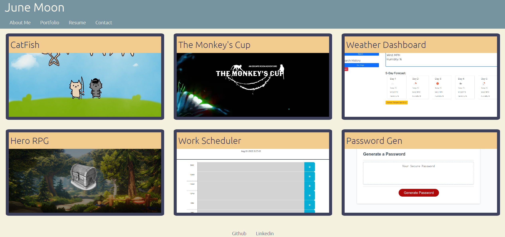

# react-portfolio-jm

## Technology Used
- javascript
- vite
- react

## Description 
This is a product of a challenge provided by UC Berkeley Extension Coding Bootcamp

This is a react portfolio application about me

## Table of Contents


* [Installation](#installation)
* [Usage](#usage)
* [Learning Points](#learning-points)
* [Credits](#credits)
* [License](#license)


## Installation


```
npm i
```


## Usage 

Simply this project is for gaining information about me for my future employer.



## Learning Points
1. Using react to form the front end element
2. Using state hooks to make the site intractable


## Credits

### June Moon
- Email: moonjunsain@gmail.com
- [Github](https://github.com/moonjunsain)
- [Linkedin](https://www.linkedin.com/in/june-moon-940538280/)


## License

MIT License

---


© 2023 edX Boot Camps LLC. Confidential and Proprietary. All Rights Reserved.